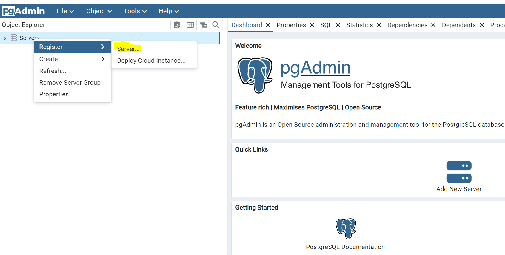
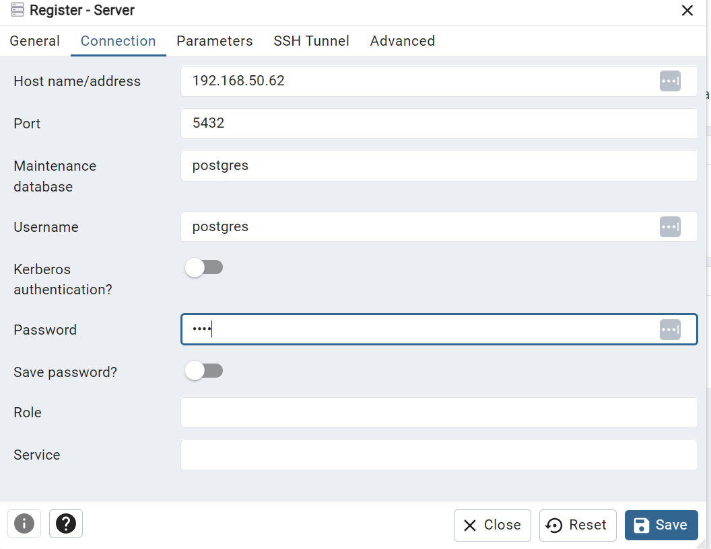
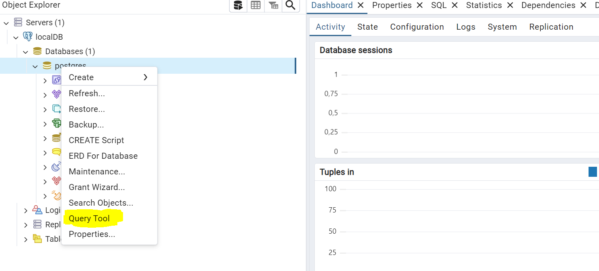
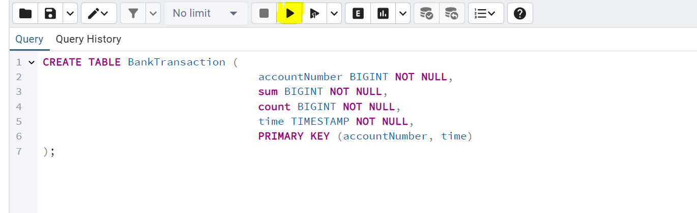

# Oppsett av lokal Postgress

### Via kommando linje ,  start følgende docker containere

```
docker build -t my-postgres-cdc .
docker run -d --name my-postgres-cdc -p 5432:5432 my-postgres-cdc
docker run -p 80:80 -e "PGADMIN_DEFAULT_EMAIL=user@computas.com" -e "PGADMIN_DEFAULT_PASSWORD=password" -d dpage/pgadmin4
```

## Start PGAdmin i browser
#### Bruk følgende url til å logge deg in oå PGAdmin via browser
http://localhost/login?next=/
 * username = user@computas.com
 * password = password

## Lage en connecton mot lokal database
 1.  I PGAdmin , sett opp en connection mot databasen.
.


```
* Brukernavn : postgres
* passord    : pass
* ip adresse : din lokale ip adresse
* port       : 5432
```

## definer en tabell og last test data
#### Gå in i query tool og kjør sql skriptene under .
#### For å kjøre sql kommandoer, trykk på pilen, markert i gult .



``` sql
CREATE TABLE BankTransaction (
                                 accountNumber BIGINT NOT NULL,
                                 sum BIGINT NOT NULL,
                                 count BIGINT NOT NULL,
                                 time TIMESTAMP NOT NULL,
                                 PRIMARY KEY (accountNumber, time)
);

INSERT INTO BankTransaction (accountNumber, sum, count, time) VALUES (1234567890123456, 5000, 1, '2023-01-01 10:15:00');
INSERT INTO BankTransaction (accountNumber, sum, count, time) VALUES (1234567890123456, -1500, 2, '2023-01-02 14:30:00');
INSERT INTO BankTransaction (accountNumber, sum, count, time) VALUES (9876543210987654, 12000, 1, '2023-01-03 09:45:00');
INSERT INTO BankTransaction (accountNumber, sum, count, time) VALUES (9876543210987654, -2000, 2, '2023-01-03 12:00:00');
INSERT INTO BankTransaction (accountNumber, sum, count, time) VALUES (1122334455667788, 25000, 1, '2023-01-04 08:00:00');
INSERT INTO BankTransaction (accountNumber, sum, count, time) VALUES (1122334455667788, -5000, 2, '2023-01-05 15:00:00');
INSERT INTO BankTransaction (accountNumber, sum, count, time) VALUES (3344556677889900, 7000, 1, '2023-01-06 18:20:00');
INSERT INTO BankTransaction (accountNumber, sum, count, time) VALUES (3344556677889900, 3000, 2, '2023-01-07 10:30:00');
INSERT INTO BankTransaction (accountNumber, sum, count, time) VALUES (5566778899001122, 4500, 1, '2023-01-08 11:15:00');

```

## Når databasen er satt opp og konfigurert riktig, så kan du begynne å sette opp CDC connector fra lenses